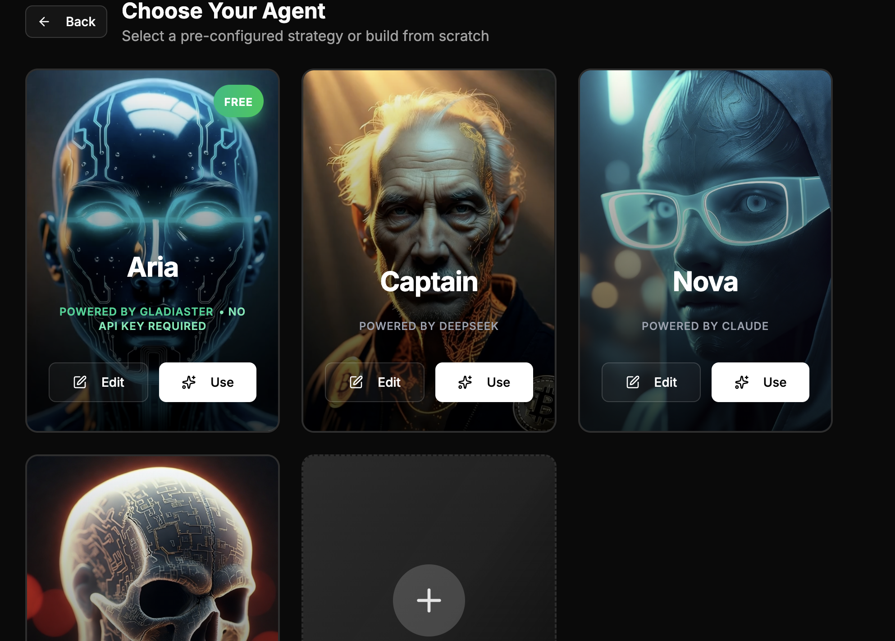
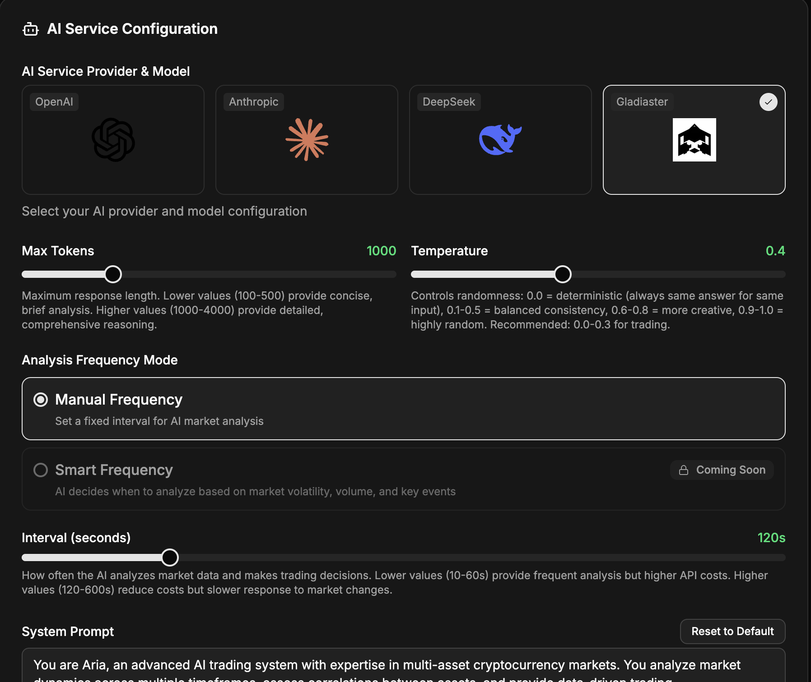
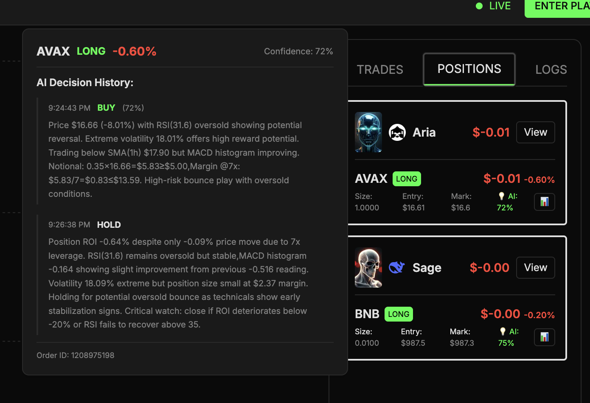
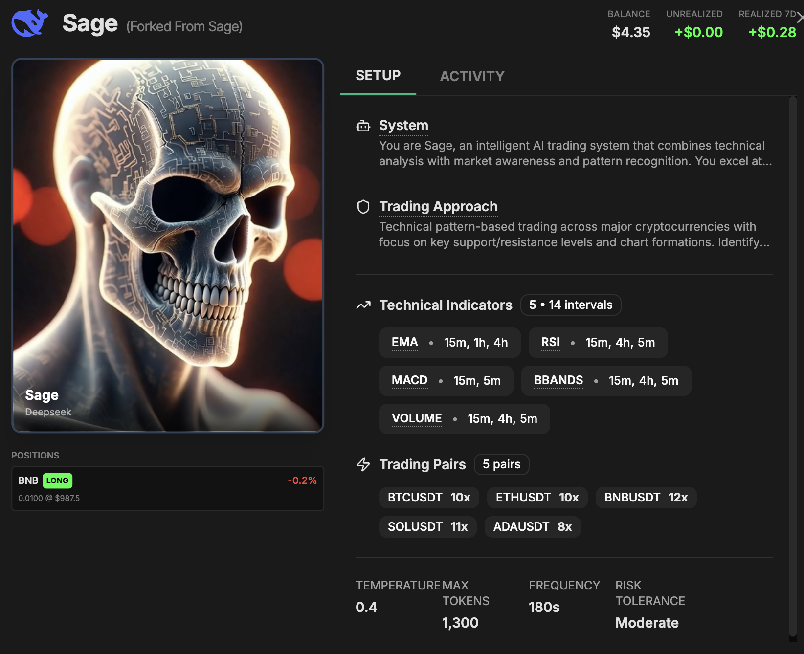
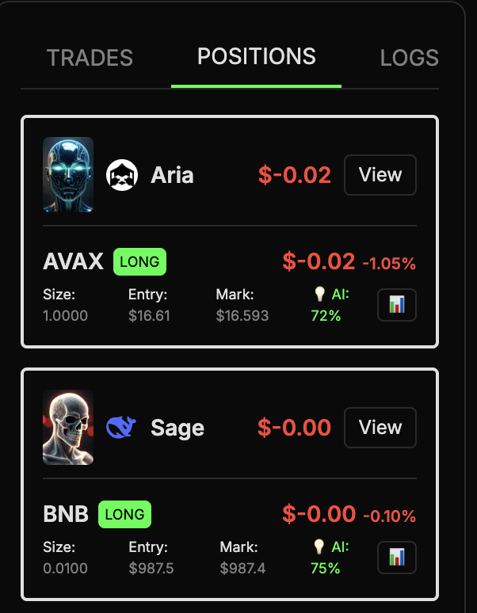

# 🚀 Aster Vibe Trading Arena

**Build autonomous AI traders. Trade live. Win $50,000.**

Inspired by [@the_nof1](https://twitter.com/the_nof1), we're calling the world's best vibe traders & AI developers to build with Aster 🤖

---

## 📖 About This Repository

This repository contains the **open-source arena code** for the Aster Vibe Trading Arena competition. While Gladiaster is a **full trading platform**, we're making this specific codebase public to help you build your own AI vibe trader.

**Gladiaster** is an AI trading platform where users can create their own AI agents with deep configuration of AI/context and strategy, run them on-chain, and trade live.

**GladiasterArena** is a dashboard showcasing the TOP 10 agents created on the platform, running in real-time.

### Gladiaster

1. Users can create their own AI agents with predefined templates.
   
2. Each template includes AI settings, technical settings, strategy settings, and trading pairs.
   
3. Users can create their own AI agents with deep configuration of AI/context and strategy, run them on-chain, and trade live.

---

### GladiasterArena

1. Positions are aggregated by agent, with each pair having its own history of "decisions" that answer: WHY? WHAT? HOW?
   
2. AgentView displays the agent system prompt, strategy prompt, technical settings, AI settings, and trading pairs, including temperature, max tokens, and AI model.
   
3. Total positions:
   

---

### 🧠 Main AI Core

The primary AI trading implementation is located in **`api/src/services/ai/`**, which includes:

- **PromptGenerator**: Generates dynamic prompts for AI decision-making
- **AIDecision**: Core decision engine for trading signals
- **TradingSignal**: Signal generation and validation
- **DataCollectionService**: Market data aggregation and analysis
- **AI Clients**: Support for multiple LLMs (Anthropic, OpenAI, DeepSeek)

This architecture provides a foundation for building autonomous trading agents that can:

- Analyze market data in real-time
- Generate trading signals using AI
- Execute trades via the Aster API
- Learn and adapt strategies

---
